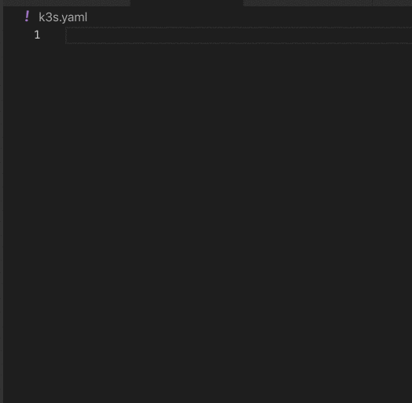

Its really frustrating to edit yaml files without a schema. I burned myslef by trying to create k3os config files by hand...

[JSON Schema](http://json-schema.org/draft-04/json-schema-core.html) is a specification, which defines structure of JSON data. Yaml is a superset of json, 
so the tooling for json schema validation can be used for yaml as well.

VisualStudio Code has a [yaml extension](https://github.com/redhat-developer/vscode-yaml)
which supports json schemas.

So what this is the process:
- Install [VSCode](https://code.visualstudio.com/download)
- Install [Yaml extension](https://marketplace.visualstudio.com/items?itemName=redhat.vscode-yaml)
- Define a json schema for k3os config (see below)



## For the impatient

So I've created a json schema for k3os config. Features:

- all elements are optional
- no extra elements are allowed (misstyping is catched)
- type safe elements (no more accidental space in ssh_authorized_keys)
- enums are defined (actually i found only one: datasources)

To get it working: in the command palette (view/command palette) type:
**>Preferences:Open Settings (JSON)**, and near the bottom, add the following lines:

```

 "yaml.schemas": {
        "https://raw.githubusercontent.com/lalyos/k30s-jsonschema/master/k3os-yajson.json": "k3s.yaml"
  }
```

## Explanation of the DSL

[Yajsonschema](https://github.com/wryun/yajsonschema) Is a compact DSL for describing a json schema.
Instead of using the "standard" verbose json format, it uses a short ... khmmm ... yaml syntax. 

(yep we are in the process to create a schema for a yaml, but first we convert it to json, because json
has a formal json schema definition, but we will generate the schema from a yaml ...)

To demonstrate why it makes sense, consider the following example. Let's say there is a json file to 
describe human-cat relationships. An example could be:

```
{
  "owner": "Jon",
  "age": 29,
  "cats": [
    {
      "name": "",
      "grumpy": true,
      "color": "orange"
    }
  ]
}
```

A really simple yajsonschema could be: 
```
owner: !type string
age: !type integer
cats:
- name: !type string
  grumpy: !type boolean
  color: !enum [black, white, brown, orange, rainbow]
```

It's only 6 lines, and you can understand it without reading a couple of hundred lines specification.
The equivalent JSON Schema is 45 lines long ...

You can experiment with it in a browser at [yajsonschema](https://wryun.github.io/yajsonschema/)

### Optional properties

To declare a property optinal, just add a `?` to the end of the property:
```diff
...
owner: !type string
-age: !type integer
+age?: !type integer
cats:
...
```

### Disabling undefined proerties

By default extra properties are allowed. If you want to be strict, 
and disable it, you have to add a special `-` boolean property,
which means if extra properties are allowed.

```diff
 owner: !type string
 age: !type integer
 cats:
 - name: !type string
   grumpy: !type boolean
   color: !enum [black, white, brown, orange, rainbow]
+  -: false
```
Note: this example will disable extra properties for cats, but owners still can have undefined props.
You have to disable it for each type/object level.

### Min/max contstraints

For example to describe that a name string should be at least 4 characters:
```
name: !type {
  type: string,
  minLength: 4
}
```

### Reuse types

If the are common types, and you dont want to copy/paste, you can create an
optional first yaml document with type definitions. Than the 2. part can use them 
as `!ref customptype`

```
strlist:
- !type string
small: !type {
   type: integer
   max: 9
}
---
name: !type string
arms: !ref small
cv: !ref strlist
```

## DSL based generation

You can define your schema in a more compact DSL, and generate the full jsonschema from it.
See https://wryun.github.io/yajsonschema/

See my effort to define [k3os DSL](k3os-yajson.yaml)
Create a jsonschema from it (with enums, and simple min/max validation)
```
yajsonschema -s k3os-yajson.yaml > k3os-yajson.json
```

## Generators

I've tried various schema generators, they take a json sample as input, 
and generate a json schema. They give you a quick start, but lack the fine 
details, like min/max constraints, optionalibilty, and enums. 

I might just started to fine tune the generated schema, but I dont't like
haf generated, half hand written files. (I have memories about Rational Rose)

For more complex schemas they might give you a good start. The [Generators page](GENERATORS.md) gives you details about how to use them.